# Hey, I'm Parakh Pratyush 👋

> CSE Student | Building AI Projects | Python • DSA • ML

---

## 🚀 About Me
- 💻 Building AI-powered projects from scratch
- 🧠 Solving DSA problems daily on LeetCode
- 🌱 Currently learning Python, Flask, AI Engineering
- 🔍 Exploring — figuring out what to build next

---

## 📁 My Repositories
| Repository | Description | Status |
|-----------|-------------|--------|
| [Python-DSA](https://github.com/parakhpratyush/Python-DSA) | Daily DSA practice — ongoing journey | 🔄 Active |

---

## 🛠️ Tech Stack

 

 

---

## 📫 Connect

 https://linkedin.com/in/parakh-pratyush-b7a881390

 https://leetcode.com/parakhpratyush
